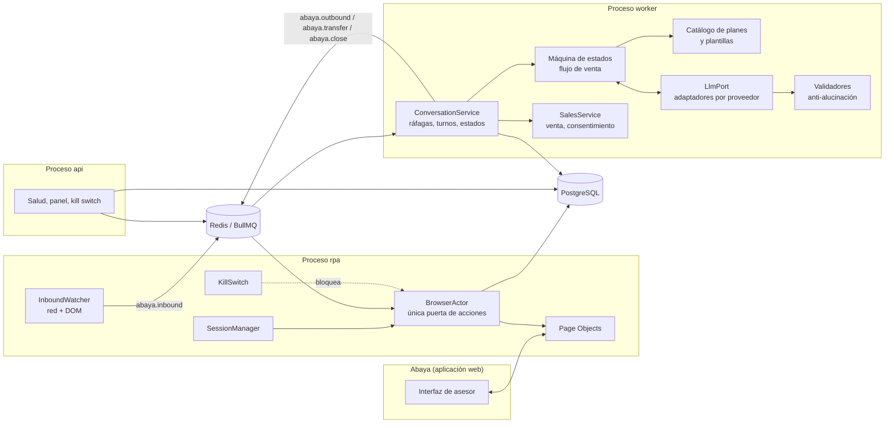
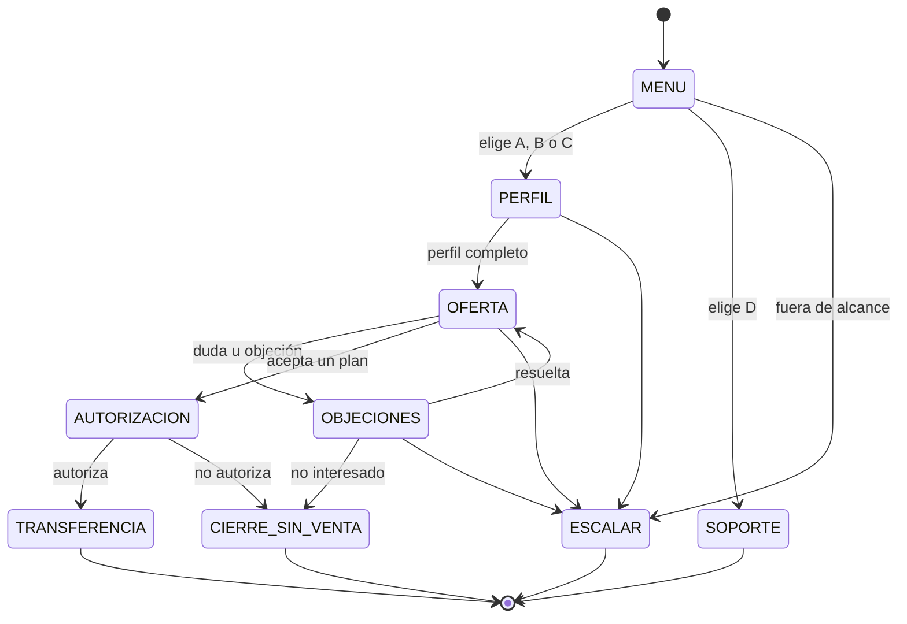
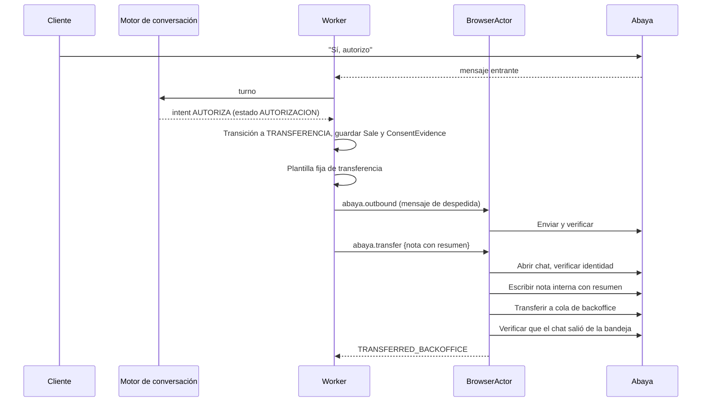

# Plan del proyecto: Agente RPA de ventas en Abaya

> Proyecto nuevo · Versión 1.9 · Octubre 2026
> Cambio v1.1: motor de conversación propio con API directa de LLM (reemplaza a Retell)
> Cambio v1.8: configuración del agente en el panel (guion en un bloque de texto, estilo Dapta/Retell), sección 6.3.8
> Cambio v1.9: Brains (bases de conocimiento); fase K1 = catálogo de planes versionado y publicado con evaluación, sección 6.3.9 y docs/DECISIONS.md (D-001)
> Herramienta de desarrollo: Claude Code
> Estado: listo para iniciar

---

## 0. Resumen ejecutivo

Construiremos un **agente RPA** que opera la aplicación web **Abaya** exactamente como lo haría un asesor humano:

1. **Inicia sesión** en Abaya con un usuario dedicado.
2. **Gestiona los chats** que le asignan: detecta mensajes nuevos, los lee y responde.
3. **Vende**: la conversación la conduce un **motor de conversación propio**. El código controla el flujo con una máquina de estados y un modelo de lenguaje (por API directa) solo redacta las respuestas, sin poder inventar planes, precios ni textos legales.
4. **Transfiere al backoffice**: cuando la venta está lista, deja una nota con el resumen estructurado y transfiere el chat a la cola de backoffice usando la función nativa de Abaya.

| Aspecto | Decisión |
|---|---|
| Automatización | Playwright + TypeScript (lectura del DOM y del tráfico de red, no visión por capturas) |
| Motor de IA | Motor propio: máquina de estados + catálogo en base de datos + LLM por API directa (proveedor elegido por evaluación) detrás de un puerto intercambiable |
| Anti-alucinación | El modelo nunca es fuente de datos: precios, planes y textos legales los inserta el código; salidas estructuradas validadas antes de enviar |
| Backend | NestJS, PostgreSQL + Prisma, Redis + BullMQ |
| Despliegue | Docker en una máquina con acceso a Abaya |
| Duración | **10 a 12 semanas** para un desarrollador con Claude Code |
| Mayor riesgo | Accesos a Abaya (ambiente de pruebas, usuario robot, MFA) y cambios futuros en su interfaz |

---

## 1. Alcance

### 1.1 Dentro del alcance

- Login, mantenimiento y recuperación de sesión en Abaya.
- Detección de chats asignados y mensajes nuevos.
- Respuesta automática generada por el agente de IA.
- Agrupación de ráfagas de mensajes del cliente (un solo turno por ráfaga).
- Flujo de venta completo hasta la autorización del cliente.
- Registro de la venta con resumen estructurado.
- Transferencia del chat al backoffice en Abaya con nota interna.
- Cierre de chats que no son venta (soporte, desinterés, inactividad).
- Auditoría, evidencia de consentimiento, alertas, monitoreo y apagado de emergencia.
- Panel mínimo de operación (salud, chats activos, ventas transferidas, errores).

### 1.2 Fuera del alcance (versión 1)

- Panel de asesores, colas propias o asignación de chats (lo hace Abaya).
- Gestión del backoffice después de la transferencia (lo hace Claro).
- Integración por API con Abaya (si llega, se agrega como adaptador nuevo).
- Canales distintos a los chats de Abaya.

---

## 2. Arquitectura

### 2.1 Vista general

```
Cliente ↔ Abaya (web) ↔ RPA (Playwright) ↔ Motor de conversación ↔ LLM (API directa)
                ↓
       Cola de backoffice en Abaya
```

### 2.2 Componentes



### 2.3 Procesos

| Proceso | Responsabilidad |
|---|---|
| `rpa` | Navegador, sesión, lectura de mensajes, ejecución de acciones en Abaya. |
| `worker` | Motor de conversación (máquina de estados, llamadas al LLM, validadores), ventas, outbox. |
| `api` | Salud, panel de operación, kill switch, consultas de auditoría. |
| `scheduler` (dentro de `worker`) | Inactividad, prueba de humo, limpieza de trazas. |

### 2.4 Principio clave: el BrowserActor

Un navegador tiene **una sola pantalla activa**. Si dos procesos actúan a la vez, el robot puede escribir en el chat equivocado. Por eso:

- Toda acción que cambia la interfaz (abrir chat, escribir, enviar, dejar nota, transferir, cerrar) pasa por el `BrowserActor`, que ejecuta **una acción a la vez** (BullMQ, concurrencia 1 por sesión).
- La lectura por red puede ocurrir en paralelo porque no toca la interfaz.
- Para más volumen se agregan **más usuarios robot**, no más concurrencia dentro de una sesión.

### 2.5 Arquitectura del código

Monolito modular con arquitectura hexagonal:

- **Dominio:** `Conversation`, `Message`, `Sale`, `Consent`, reglas de estado. Sin dependencias externas.
- **Puertos:** `ChatChannelPort` (Abaya), `LlmPort` (modelo de lenguaje), `AlertPort`, `ClockPort`.
- **Adaptadores:** `AbayaRpaAdapter`, `AnthropicLlmAdapter`, `OpenAiLlmAdapter`, `GeminiLlmAdapter` (o sus versiones vía la nube de Claro: Bedrock, Azure OpenAI, Vertex), alertas por correo/Slack/Teams.
- **Eventos de dominio con Transactional Outbox:** `MessageReceived`, `ReplyReady`, `SaleCompleted`, `TransferRequested`, `ConversationTransferred`, `ConversationClosed`.

Si mañana Abaya publica una API, se crea `AbayaApiAdapter` y el resto no cambia. Si se cambia de proveedor de LLM, se cambia una variable de configuración.

### 2.6 Despliegue: servidor padre y robots hijos *(cambio v1.4)*

- **Padre (servidor):** PostgreSQL, Redis, `worker` y `api` + panel. Guarda el registro de robots (`Robot`): usuario de Abaya, contraseña y secreto TOTP **cifrados**, estado, equipo donde corre y presencia.
- **Hijo (cada computador):** solo el proceso `rpa`, instalado con un paquete para Windows. El instalador pide **la URL del servidor y un código de instalación de un solo uso** (generado en el panel, vence en 24 h). Con el código obtiene un token de robot, lo guarda en el equipo y, en cada arranque, descarga del padre su configuración (credenciales de Abaya, conexión a base de datos y colas, clave de cifrado), que **solo vive en memoria**.
- **Un robot = un usuario de Abaya = un equipo a la vez.** Al arrancar, el hijo *reclama* su robot en la base de datos; si otra instancia está en línea (presencia de menos de 60 s), se niega a iniciar sesión en Abaya y queda registrado el intento. Presencia cada 15 s; al apagarse en orden queda `STOPPED` (no dispara la alerta de heartbeat perdido).
- **Control por robot desde el panel:** pausar/reanudar (bandera `abaya:pause:<robot>` revisada antes de cada acción junto con el kill switch global), deshabilitar (revoca el token; el hijo en marcha se apaga en su siguiente presencia), nuevo código de instalación (reinstalar o cambiar de equipo) y cambio de credenciales.
- **Trazabilidad por equipo:** cada robot registra nombre del equipo, versión, inicio y última presencia; el panel muestra el estado de cada uno y su rendimiento (conversaciones, ventas, conversión, tiempos por acción, errores) por rango de fechas, y su historial de acciones.
- El modo por `.env` se mantiene para desarrollo, pruebas y la demo.

### 2.7 Capacidad por robot: 3 chats simultáneos *(cambio v1.5)*

Meta de operación: **cada robot atiende hasta 3 chats a la vez** con tiempo de respuesta p95 < 15 s.

- **Tope:** se pide a Claro limitar en Abaya a 3 chats simultáneos por usuario robot. Del lado del sistema, `MAX_CHATS_PER_ROBOT` (por defecto 3): si un robot supera el tope se sigue atendiendo, pero se dispara la alerta `ROBOT_OVERLOADED` y el panel muestra los chats activos de cada robot.
- **Prioridad en el `BrowserActor`:** la fila sigue siendo de una acción a la vez, pero en orden de urgencia: 1) enviar mensajes, 2) abrir chat, 3) transferir, 4) leer la bandeja (reconciliación, humo), 5) cerrar. Dentro de la misma prioridad, orden de llegada. Es seguro: los envíos de un chat siempre salen antes que su transferencia o cierre.
- **Tiempo de respuesta al cliente:** desde que el robot detecta el primer mensaje de la ráfaga hasta que Abaya confirma la primera respuesta (`Message.respondsToAt` → `Message.sentAt`, ambas con el reloj del robot). p50/p95 por robot en el panel; alerta `RESPONSE_SLOW` si el p95 de los últimos 15 min supera `RESPONSE_P95_ALERT_MS` (20 s).
- **Modelo:** timeout de 8 s con 1 reintento (antes 15 s), *prompt caching* y proveedor de respaldo opcional (`LLM_FALLBACK_PROVIDER`).
- **Reciclaje del navegador:** el robot reinicia Chromium cada `BROWSER_RECYCLE_HOURS` (6 h) solo cuando su bandeja está vacía y no tiene acciones pendientes.
- **Barrido de mensajes no detectados** (sección 6.2, paso 6).
- **Prueba de carga** (`pnpm loadtest`): N robots × 3 clientes simulados escribiendo a la vez contra el Abaya simulado. Criterio: 0 mensajes en chat equivocado, 0 duplicados, 0 perdidos, p95 < 15 s y p99 < 25 s.

### 2.8 Hijo delgado: el robot solo habla con el servidor por HTTPS *(cambio v1.6)*

Elimina el riesgo aceptado B5 (sección 8): ningún equipo robot recibe la conexión a PostgreSQL, a Redis ni la clave de cifrado de campos.

- **Pasarela de robots en el servidor** (`/robot-api/v1`, proceso `api`):
  - `POST /token`: cambia el token de renovación del equipo por un token de acceso de 1 h firmado (HMAC con clave derivada) y un token de renovación nuevo (rotación).
  - `GET /config`: solo lo que el robot necesita para Abaya (URL, usuario, contraseña, TOTP); nada de base de datos, Redis ni claves.
  - `POST /rpc`: operaciones del robot validadas con zod (guardar entrantes, estado de envíos, auditoría, sesión, presencia, recuperación, barrido, transferencias, alertas). **El robot se deduce del token**: cualquier dato de otro robot se rechaza.
  - `POST /traces`: el robot sube las trazas de error; el servidor las guarda cifradas (visibles desde el panel, solo ADMIN, auditado).
  - WebSocket `/ws`: el servidor **empuja** al robot sus tareas (enviar, transferir, cerrar) desde sus colas de BullMQ y el estado del kill switch y de la pausa. Sin conexión, el robot se considera detenido (falla cerrado).
- **Cifrado:** el servidor cifra y descifra; el robot recibe por TLS solo el texto de sus propios mensajes.
- **Token atado al equipo:** `robot.json` guarda el token de renovación y una clave local cifrados con DPAPI (usuario de Windows). Copiar el archivo a otro equipo no sirve. **Rotación con detección de reúso:** si se presenta un token ya rotado y el nuevo ya se usó, se revocan todos los tokens del robot y se alerta `ROBOT_TOKEN_REUSE`.
- **Clave local por equipo** para la sesión guardada de Abaya y las trazas pendientes de subir.
- **Límite de peticiones** por robot en la pasarela y auditoría de altas, renovaciones y rechazos.
- El modo directo (`.env`) se mantiene solo para desarrollo, pruebas y la demo.

### 2.9 Actualizaciones de los robots y preparación de los equipos *(cambio v1.7)*

- **Firma propia (Ed25519):** cada paquete publicado lleva un manifiesto (versión, SHA-256, tamaño) firmado con la clave privada de publicación, que vive solo donde se arma el paquete (`.secrets/`, nunca en el repositorio ni en el servidor). Cada robot trae la clave pública y **solo instala paquetes con firma válida**; si no, rechaza y alerta `ROBOT_UPDATE_FAILED`. No requiere certificado comercial (este sigue siendo recomendable para que Windows no muestre el aviso en la primera instalación).
- **Versiones lado a lado en el equipo:** `versions\<versión>\{app,node}` y `current.txt`. El lanzador (`iniciar.ps1`) arranca la versión vigente.
- **Desde el panel:** ADMIN pulsa "Actualizar" (un robot o todos). El servidor avisa al robot por el WebSocket; el robot **espera a tener la bandeja vacía y la fila sin acciones** (no puede impedir que Abaya le asigne chats), descarga el paquete por la pasarela, verifica firma y SHA-256, lo prepara en `versions\` y sale con código 4. El lanzador cambia de versión y arranca la nueva.
- **Reversión automática:** si la versión nueva no llega a "en línea" (dos fallas seguidas en sus primeros 2 minutos), el lanzador vuelve a la anterior; el robot reporta `ROLLED_BACK` y se alerta. Confirmada la nueva (2 min en línea), reporta `APPLIED`.
- **Botón local de respaldo:** `actualizar.cmd` en el equipo pide la actualización al robot en marcha (archivo de solicitud), sin credenciales.
- **Preparación del equipo:** el instalador revisa y avisa: suspensión del equipo, horas activas de Windows Update, inicio de sesión automático, espacio en disco y la excepción del antivirus (recordatorio).
- **Respaldo del servidor:** `pg_dump` diario con retención y prueba de restauración documentados en el runbook.

---

## 3. Stack tecnológico

| Área | Tecnología | Motivo |
|---|---|---|
| Lenguaje | TypeScript estricto, Node.js LTS | Un solo lenguaje para todo. |
| Monorepo | pnpm workspaces + Turborepo | Procesos y paquetes compartidos. |
| Framework | NestJS (Express) | Módulos, inyección de dependencias, estructura clara. |
| Automatización | **Playwright** (Chromium), versión fijada | Esperas automáticas, intercepción de red y WebSocket, sesión persistente, trazas. |
| Base de datos | PostgreSQL + Prisma | Transacciones, restricciones únicas para deduplicar. |
| Colas | Redis + BullMQ | Reintentos, desacople, concurrencia controlada. |
| Validación | zod | Configuración, payloads de Abaya y salidas estructuradas del LLM. |
| LLM | SDK oficial de cada proveedor detrás de `LlmPort` | Salidas estructuradas (JSON Schema), *prompt caching*, sin intermediarios. |
| Evaluación | Suite propia de conversaciones guionadas (Vitest + LLM simulado y real) | Elegir proveedor con datos y evitar regresiones. |
| Logs | pino con redacción de datos personales | |
| Observabilidad | OpenTelemetry + alertas | |
| Pruebas | Vitest (unitarias), Playwright Test (fixtures y E2E) | |
| Panel | React + Vite (mínimo, fase F7) | |
| Despliegue | Docker (`mcr.microsoft.com/playwright`) + Docker Compose | |
| CI | GitHub Actions (o el que use la empresa) | |

**Descartado:** visión por capturas con IA como mecanismo principal (lenta, cara, no determinista), Selenium (más código propio para esperas y red), plataformas RPA comerciales (licencias y fuera del stack).

---

## 4. Estructura del repositorio

```
abaya-rpa/
  apps/
    rpa/
      src/
        abaya/
          selectors.ts              # ÚNICO lugar con selectores
          pages/                    # LoginPage, ChatListPage, ChatPage,
                                    # NotePage, TransferPage
          network/                  # parsers de XHR/WebSocket (zod)
          dom/                      # MutationObserver de respaldo
        session/                    # SessionManager, storageState cifrado
        actor/                      # BrowserActor y acciones
        inbound/                    # InboundWatcher, huella de mensaje
        safety/                     # KillSwitch, ChatIdentityGuard
        observability/              # trazas solo en error
      Dockerfile
    worker/
      src/
        conversation/               # agrupador de ráfagas, turnos
        engine/
          state-machine.ts          # estados y transiciones del flujo de venta
          stages/                   # instrucciones y esquema por estado
          prompts/                  # prompts versionados por estado
          templates/                # textos fijos (legal, precios, despedidas)
          validators/               # anti-alucinación
        llm/
          llm.port.ts
          adapters/                 # anthropic, openai, gemini
        catalog/                    # planes desde base de datos
        sales/                      # venta, consentimiento, resumen
        scheduler/                  # inactividad, humo, limpieza
        outbox/
    api/
      src/
        health/
        admin/                      # panel, kill switch, auditoría
    panel/                          # React + Vite (F7)
  packages/
    domain/                         # entidades, puertos, eventos
    db/                             # schema Prisma y cliente
    config/                         # esquemas zod de configuración
    crypto/                         # cifrado de campos, cadena de hashes
    logger/                         # pino con redacción
  evals/
    conversations/                  # casos guionados (YAML) con resultado esperado
    run-evals.ts                    # corre la suite contra uno o varios proveedores
  fixtures/
    abaya/                          # HTML y payloads SANITIZADOS
  docs/
    planRPA.md                      # este documento
    abaya-mapa-pantallas.md         # resultado de F1
    runbook.md                      # resultado de F8
  docker-compose.yml
  CLAUDE.md
  .env.example
```

---

## 5. Modelo de datos (borrador Prisma)

```prisma
enum ConversationStatus {
  ACTIVE
  WAITING_CONSENT
  TRANSFERRING
  TRANSFERRED_BACKOFFICE
  CLOSED_NO_SALE
  CLOSED_SUPPORT
  CLOSED_INACTIVE
  NEEDS_REVIEW        // algo quedó incierto: requiere humano
}

model Conversation {
  id              String             @id @default(cuid())
  abayaChatId     String             @unique
  stage           String             @default("MENU")  // estado de la máquina
  profileEncrypted Bytes?            // datos extraídos (nombre, operador, uso)
  robotUser       String
  status          ConversationStatus @default(ACTIVE)
  customerRefHash String?            // hash del identificador del cliente
  lastInboundAt   DateTime?
  lastOutboundAt  DateTime?
  createdAt       DateTime           @default(now())
  updatedAt       DateTime           @updatedAt
  messages        Message[]
  sale            Sale?
}

enum Direction { INBOUND OUTBOUND }

enum OutboundStatus {
  PENDING
  SENDING
  SENT_VERIFIED
  UNCERTAIN          // no verificado: NUNCA se reintenta automáticamente
  FAILED
}

model Message {
  id              String          @id @default(cuid())
  conversationId  String
  direction       Direction
  fingerprint     String?         @unique   // entrantes: deduplicación
  idempotencyKey  String?         @unique   // salientes
  bodyEncrypted   Bytes
  status          OutboundStatus?
  detectedVia     String?         // "network" | "dom"
  attempts        Int             @default(0)
  occurredAt      DateTime
  createdAt       DateTime        @default(now())
  conversation    Conversation    @relation(fields: [conversationId], references: [id])
}

model Sale {
  id               String   @id @default(cuid())
  conversationId   String   @unique
  process          String   // tipo de venta (p. ej. portabilidad, migración, línea nueva)
  planCode         String
  summaryEncrypted Bytes    // resumen estructurado para el backoffice
  transferredAt    DateTime?
  backofficeNoteOk Boolean  @default(false)
  createdAt        DateTime @default(now())
  conversation     Conversation @relation(fields: [conversationId], references: [id])
}

model ConsentEvidence {          // append-only con cadena de hashes
  id              String   @id @default(cuid())
  conversationId  String
  textShownHash   String   // hash del texto de autorización mostrado
  customerReplyEncrypted Bytes
  acceptedAt      DateTime // hora de Bogotá
  prevHash        String
  hash            String
}

model RpaSession {
  id               String   @id @default(cuid())
  robotUser        String   @unique
  status           String   // ACTIVE | RELOGGING | DOWN | PAUSED
  lastHeartbeat    DateTime
  lastLoginAt      DateTime?
  consecutiveFails Int      @default(0)
}

model RpaActionLog {             // auditoría inmutable con cadena de hashes
  id              String   @id @default(cuid())
  robotUser       String
  action          String   // LOGIN, OPEN_CHAT, SEND, NOTE, TRANSFER, CLOSE
  abayaChatId     String?
  result          String   // OK | ERROR | UNCERTAIN
  durationMs      Int
  traceRef        String?
  prevHash        String
  hash            String
  createdAt       DateTime @default(now())
}

model Plan {                     // catálogo: ÚNICA fuente de planes y precios
  code            String   @id      // p. ej. M1, L2, P1
  process         String   // PORTABILIDAD | MIGRACION | LINEA_NUEVA
  name            String
  dataGb          Int
  priceCop        Int
  discountText    String?  // texto aprobado por Claro, no generado
  benefits        String[]
  active          Boolean  @default(true)
  validFrom       DateTime
  validTo         DateTime?
}

model PromptVersion {            // prompts versionados, nunca editados en caliente
  id              String   @id @default(cuid())
  stage           String
  version         Int
  content         String
  approvedBy      String?
  active          Boolean  @default(false)
  createdAt       DateTime @default(now())
  @@unique([stage, version])
}

model LlmCall {                  // trazabilidad de cada llamada al modelo
  id              String   @id @default(cuid())
  conversationId  String
  stage           String
  provider        String
  model           String
  promptVersionId String
  latencyMs       Int
  inputTokens     Int
  outputTokens    Int
  validationResult String  // OK | REGENERATED | FALLBACK
  createdAt       DateTime @default(now())
}

enum AgentConfigStatus { DRAFT EVALUATING PUBLISHED ARCHIVED REJECTED }

model AgentConfigVersion {       // configuración y guion del agente (v1.8, sección 6.3.8)
  id           String            @id @default(cuid())
  version      Int               @unique
  status       AgentConfigStatus @default(DRAFT)
  agentName    String
  companyName  String
  companyInfo  String
  welcome      String            // saludo antes del menú A–D (fijo en código)
  prompt       String            // bloque grande en Markdown
  model        String?           // null = el de la configuración del worker
  temperature  Float             // 0–0.3
  evalSummary  Json?             // resultado de la suite al publicar
  createdBy    String
  publishedBy  String?
  publishedAt  DateTime?
  createdAt    DateTime          @default(now())
  updatedAt    DateTime          @updatedAt
}

model OutboxEvent {
  id          String    @id @default(cuid())
  type        String
  payload     Json
  publishedAt DateTime?
  createdAt   DateTime  @default(now())
}

enum AdminRole { ADMIN OPERADOR }

model AdminUser {                // usuarios del panel de administración (v1.3)
  id                 String    @id @default(cuid())
  username           String    @unique
  passwordHash       String    // scrypt con sal; nunca la contraseña
  role               AdminRole
  active             Boolean   @default(true)
  mustChangePassword Boolean   @default(true)   // contraseña temporal
  failedAttempts     Int       @default(0)
  lockedUntil        DateTime?
  lastLoginAt        DateTime?
  createdBy          String?
  createdAt          DateTime  @default(now())
  updatedAt          DateTime  @updatedAt
  sessions           AdminSession[]
}

model AdminSession {             // sesión del panel en el servidor (cookie httpOnly)
  id          String    @id @default(cuid())
  tokenHash   String    @unique  // sha256 del token; el token solo viaja en la cookie
  userId      String
  expiresAt   DateTime  // absoluta: 8 h
  lastSeenAt  DateTime  // inactividad: 30 min
  createdAt   DateTime  @default(now())
  user        AdminUser @relation(fields: [userId], references: [id], onDelete: Cascade)
}

model Robot {                    // registro de robots hijos (v1.4, sección 2.6)
  robotUser              String    @id      // usuario de Abaya del robot
  enabled                Boolean   @default(true)
  paused                 Boolean   @default(false)
  abayaPasswordEncrypted Bytes?             // cifrada; nunca se devuelve al panel
  mfaMode                String    @default("none")
  totpSecretEncrypted    Bytes?
  enrollmentCodeHash     String?   @unique  // código de instalación de un solo uso
  enrollmentExpiresAt    DateTime?
  agentTokenHash         String?   @unique  // token del equipo instalado
  enrolledAt             DateTime?
  host                   String?            // nombre del equipo
  instanceId             String?            // instancia en línea (evita duplicados)
  version                String?
  state                  String    @default("STOPPED")  // ONLINE | STOPPED
  startedAt              DateTime?
  lastSeenAt             DateTime?
  stoppedAt              DateTime?
  lastRejectedHost       String?            // último arranque duplicado rechazado
  lastRejectedAt         DateTime?
  createdBy              String?
  createdAt              DateTime  @default(now())
  updatedAt              DateTime  @updatedAt
}
```

**Huella de mensaje entrante:**
- Si Abaya expone un id de mensaje: `sha256(abayaChatId + messageId)`.
- Si no: `sha256(abayaChatId + remitente + timestamp + texto + posición)`.
- La restricción `@unique` en base de datos es la defensa final contra duplicados.

---

## 6. Flujos

### 6.1 Sesión

1. Al arrancar: cargar `storageState` cifrado; si es válido, entrar sin login.
2. Si no: login con credenciales del gestor de secretos.
3. Heartbeat cada 30 s (verificar que se ve la bandeja de chats y no el login).
4. Si cae: pausar el `BrowserActor` y hacer relogin con espera progresiva (5 s, 15 s, 45 s, 2 min, 5 min).
5. Tras 3 fallos seguidos: estado `DOWN`, alerta crítica, no insistir (evita bloquear el usuario).
6. MFA: según respuesta de Claro (ver riesgos).
7. Al recuperar sesión: **reconciliar** los chats abiertos en Abaya con la base de datos.

### 6.2 Entrada de mensajes

1. `InboundWatcher` escucha `page.on('response')` y `page.on('websocket')` sobre las URLs de mensajes identificadas en F1.
2. Respaldo: `MutationObserver` en el contenedor de mensajes, reportando vía `page.exposeFunction`.
3. Por cada mensaje: huella → insertar `Message` (si existe, ignorar) → encolar `abaya.inbound`.
4. Ignorar mensajes propios del robot y del sistema de Abaya.
5. Chat nuevo asignado → crear `Conversation` en estado inicial.
6. **Barrido de mensajes no detectados** *(v1.5)*: cada 15 s el robot lee la bandeja; si un chat tiene no leídos y el sistema no tiene nada en curso para él (ni entrantes sin atender ni respuestas por enviar), lo abre por el `BrowserActor` para que la lectura normal recupere el mensaje. Cubre cortes del WebSocket (recargas de página, red). Encontrado por la prueba de carga: abrir un chat recargaba la página y un mensaje de otro chat llegado en ese instante se perdía.

### 6.3 Motor de conversación

**Principio:** el código decide *qué* pasa; el modelo solo decide *cómo decirlo*. El modelo nunca es fuente de datos.

#### 6.3.1 Turnos

1. Agrupador de ráfagas: esperar **4 s** sin mensajes nuevos del cliente antes de procesar.
2. **Un turno a la vez** por conversación; lo que llegue mientras tanto se acumula para el siguiente turno.
3. Varias conversaciones se procesan **en paralelo** en el worker; solo la escritura en Abaya es secuencial (BrowserActor).

#### 6.3.2 Máquina de estados



- Cada estado tiene **su propio prompt corto** (no un guion gigante), su esquema de salida y las transiciones permitidas.
- **Las transiciones las decide el código** a partir de la intención que devuelve el modelo. Si el modelo propone una transición no permitida, se ignora.
- El estado vive en `Conversation.stage`, no en la memoria del modelo.

#### 6.3.3 Salida estructurada por turno

Cada llamada al LLM devuelve JSON con esquema estricto (JSON Schema / structured outputs del proveedor) y se valida con zod:

```ts
{
  intent: "ELIGE_OPCION" | "DA_DATO" | "PREGUNTA" | "OBJECION" | "ACEPTA_PLAN"
        | "AUTORIZA" | "NO_AUTORIZA" | "NO_INTERESADO" | "FUERA_DE_ALCANCE",
  reply: string,                 // texto conversacional, SIN cifras ni precios
  planCode?: string,             // solo códigos existentes en el catálogo
  extracted?: { name?: string, currentOperator?: string, usage?: string },
  confidence: "ALTA" | "MEDIA" | "BAJA"
}
```

#### 6.3.4 Datos que el modelo nunca escribe

| Dato | Quién lo pone |
|---|---|
| Nombres de planes, gigas, precios, descuentos | Plantilla del código con datos de la tabla `Plan` |
| Texto de autorización (Ley 1266 y Ley 1581) | Plantilla fija, palabra por palabra, con fecha de Bogotá |
| Menú inicial | Plantilla fija |
| Redirección a soporte (*611) | Plantilla fija |
| Mensaje de transferencia y despedida | Plantilla fija |

El modelo redacta el texto conversacional y escribe marcadores como `{{OFERTA:M2}}` o `{{AUTORIZACION}}`; el código los reemplaza. Si el modelo usa un código de plan que no existe o no aplica al proceso, la respuesta se rechaza.

#### 6.3.5 Validadores (antes de enviar cualquier respuesta)

1. **Esquema:** la salida cumple el esquema zod.
2. **Cifras prohibidas:** el `reply` no contiene números de precio, "$", "GB", "%", "megas" ni fechas fuera de las plantillas.
3. **Catálogo:** todo `planCode` existe, está activo y corresponde al proceso de la conversación.
4. **Promesas prohibidas:** lista de frases no permitidas (por ejemplo "gratis", "sin costo", "garantizado", "te regalo") salvo que vengan de una plantilla.
5. **Transición:** la intención lleva a una transición permitida desde el estado actual.
6. **Longitud y formato:** límite de caracteres, formato WhatsApp (`*negrita*`).

Si falla: **regenerar una vez** con el error explicado al modelo. Si vuelve a fallar: **respuesta segura** de plantilla ("Déjame confirmarte ese detalle…") o escalar. Cada resultado se registra en `LlmCall.validationResult`.

#### 6.3.6 Configuración del modelo

- Temperatura baja (0–0.3).
- Contexto mínimo: instrucciones del estado actual, perfil extraído, catálogo filtrado al proceso y últimos N mensajes (con resumen si la conversación es larga).
- *Prompt caching* de la parte fija del prompt para bajar latencia y costo.
- Timeout de 8 s y 1 reintento *(v1.5; antes 15 s)*; si el proveedor falla y hay proveedor de respaldo (`LLM_FALLBACK_PROVIDER`), se usa el respaldo; si también falla, conversación a `NEEDS_REVIEW` y alerta.
- Prompts versionados en `AgentConfigVersion` *(v1.8; antes `PromptVersion`, que queda como histórico)* y editados desde el panel (sección 6.3.8); ningún cambio sale a producción sin pasar la suite de evaluación (sección 12).

#### 6.3.7 Elección del proveedor

Se implementan al menos dos adaptadores y se elige con la suite de evaluación comparando: cumplimiento de reglas (%), tasa de regeneración, latencia p50/p95 y costo por conversación. Un modelo de gama media rápida suele bastar. Si Claro tiene nube contratada (Azure, Google Cloud o AWS), se prioriza el modelo disponible ahí por contratos y transferencia internacional de datos (Ley 1581).

#### 6.3.8 Configuración del agente en el panel *(cambio v1.8)*

Por familiaridad con Dapta y Retell, el guion del agente se edita en el panel como **un bloque de texto grande en Markdown** (rol, conocimiento general, flujo por etapa, objeciones, estilo), junto a un **apartado de configuración**: nombre del agente, nombre y descripción de la empresa, modelo (de una lista permitida, `LLM_ALLOWED_MODELS`), temperatura (0–0.3; los modelos Claude no la usan) y mensaje de bienvenida.

- **Lo que no cambia:** el bloque define *cómo* habla el agente; la máquina de estados sigue decidiendo el flujo (regla 12), el menú A–D, la autorización y los textos legales siguen siendo plantillas del código, y los validadores de 6.3.5 aplican igual (regla 10).
- **Precios y planes fuera del bloque (regla 11):** a diferencia de Retell, el catálogo no se pega en el prompt. El panel lo muestra al lado en solo lectura (como el *Brain* de Dapta) y el guion lo nombra con `{{OFERTA:CODIGO}}`. Al guardar, el bloque y la bienvenida se revisan: se rechazan precios, gigas, porcentajes y, en la bienvenida, promesas prohibidas.
- **Reglas del sistema:** una parte fija del prompt (intenciones, esquema de salida, marcadores, prohibición de cifras y textos legales, anti-manipulación) va siempre antes del guion y no se edita; el panel la muestra en solo lectura.
- **Etapas:** el guion organiza las instrucciones por etapa con títulos `## MENU`, `## PERFIL`, `## OFERTA`, `## OBJECIONES`, `## AUTORIZACION`; en cada turno el código le indica al modelo la etapa actual.
- **Versiones:** cada guardado es un borrador (`AgentConfigVersion`, estado `DRAFT`). **Publicar** corre la suite de evaluación (sección 12.1) con el borrador contra el proveedor real; solo si da 0 datos inventados y ≥ 95 % pasa a `PUBLISHED` (la anterior queda `ARCHIVED`); si no, `REJECTED` con el reporte (regla 13). Con el proveedor `simulado` no se puede publicar. Una sola versión publicada a la vez; historial con "restaurar como borrador".
- El worker usa la versión publicada (la relee cada 30 s); cada `LlmCall` guarda el id de la versión usada. Sin versión publicada se usa la v1 del código.
- **Probar agente** (como en Dapta/Retell): chat de simulación en el panel que corre turnos del motor real (máquina de estados, catálogo, plantillas y validadores) en el worker, por la cola `abaya.agent-test`. Muestra las respuestas, su origen (plantilla, modelo validado, regenerado, respuesta segura), los eventos (consentimiento, transferencia, cierre, escalado) y el estado (etapa y datos extraídos). No toca Abaya ni guarda la conversación. Un `ADMIN` prueba lo que hay en el editor (revisado, aunque no esté guardado); un `OPERADOR`, la versión publicada.
- Permisos: ver y probar la versión publicada, ambos roles; guardar, publicar, restaurar y probar el editor, solo `ADMIN`. Los cambios quedan en `AdminAuditLog`.

#### 6.3.9 Brains: catálogo versionado *(cambio v1.9)*

Diseño completo y decisiones en `docs/DECISIONS.md` (D-001). Resumen de lo que cambia en K1:

- El catálogo deja de cargarse directo en `Plan`: vive en un **Brain** (`Brain`, `BrainVersion`, `KnowledgeSource`, `CatalogRecord`) cargado desde **Excel o CSV** con el esquema de columnas de Claro (Proceso, ID, Datos, GB para compartir, Incluye, Servicios adicionales, Apps ilimitadas, Llamadas y mensajes, Precio, Descuento; Nombre opcional). El archivo se valida al cargarlo y se guarda **como registros**, no como texto. `Plan` queda obsoleto (solo histórico).
- Cada cambio de fuentes crea un **borrador**; el agente usa solo la versión **publicada**. Publicar = pasar la suite de evaluación (regla 13) con el agente publicado + el catálogo borrador; se audita con el **diff** de registros. Revertir = borrador copia de una versión anterior.
- La consulta del catálogo (`consultar_planes(proceso)`) la hace el **código**, no el modelo (reglas 11 y 12): filtro exacto por proceso; sin planes para el proceso → plantilla de escalado a un asesor, sin llamar al modelo.
- Trazabilidad: `KnowledgeUsage` por turno (Brain, versión, códigos entregados y mostrados, hash) y `Sale.catalogVersionId`.
- Solo `ADMIN` edita y publica (permiso `publicarConocimiento` en el código). Archivos cifrados en PostgreSQL detrás del puerto `BlobStore` (no hay S3).
- Fases siguientes (K2 panel, K3 contexto completo, K4 RAG con pgvector, K5 páginas web) en `docs/DECISIONS.md`.

### 6.4 Envío

1. Verificar `KillSwitch`.
2. Abrir el chat por `abayaChatId`.
3. **ChatIdentityGuard:** confirmar en pantalla que es el chat correcto. Si hay duda: abortar, `UNCERTAIN`, alerta.
4. **Idempotencia:** solo si un intento anterior pudo haber enviado este mensaje (quedó en `SENDING` porque el proceso murió): si el texto aparece entre los últimos mensajes del robot, marcar `SENT_VERIFIED` sin reenviar; si no aparece, `UNCERTAIN`. Un mensaje `PENDING` siempre se envía, aunque el robot ya haya dicho el mismo texto antes. *(Cambio v1.2: la regla original descartaba en silencio respuestas legítimas repetidas, como plantillas o respuestas cortas; detectado en la demo de punta a punta.)*
5. Escribir respetando saltos de línea y formato de WhatsApp (`*negrita*`).
6. Enviar y esperar que el mensaje aparezca **confirmado por el servidor** (no basta el pintado optimista de la interfaz) y que haya **uno más** que antes de enviar (un texto repetido no se confunde con el anterior). Timeout 10 s.
7. Resultado: `SENT_VERIFIED` o `UNCERTAIN`. Un `UNCERTAIN` **nunca** se reintenta solo: pasa a revisión.

### 6.5 Venta y transferencia al backoffice



**Resumen para el backoffice (nota interna):** proceso de venta, plan elegido, nombre del cliente, operador actual, número a portar o migrar si aplica, fecha y hora de la autorización (Bogotá), identificador de conversación. Formato fijo definido con Claro en F6.

Si la transferencia falla: 2 reintentos, luego estado `NEEDS_REVIEW` y alerta crítica. Un cliente que autorizó y no llegó al backoffice es una venta perdida.

### 6.6 Cierres sin venta

| Motivo | Acción en Abaya (confirmar con Claro) |
|---|---|
| Soporte (redirigir a *611) | Mensaje final y cerrar o liberar el chat |
| Cliente no interesado | Mensaje final y cerrar |
| Inactividad (120 min) | Mensaje opcional y cerrar o liberar |
| Caso que la IA no puede manejar | Transferir a la cola humana que defina Claro |

---

## 7. Reglas no negociables

Van en `CLAUDE.md`. Claude Code debe respetarlas en todas las fases.

1. **Nunca escribir en un chat sin verificar su identidad.**
2. **Nunca reintentar a ciegas un envío o transferencia incierta.**
3. **Selectores solo en `selectors.ts`**, semánticos (`getByRole`, `getByText`, `getByLabel`, `data-*`). Prohibidas las rutas CSS largas o por posición.
4. **Toda acción de interfaz pasa por el `BrowserActor`.**
5. **KillSwitch revisado antes de cada acción.**
6. **Sin datos personales en logs**; contenido de mensajes y resúmenes cifrados en base de datos.
7. **Sin credenciales** en código, `.env` versionado, fixtures, trazas ni conversaciones con Claude Code.
8. **Fixtures siempre sanitizados.**
9. **Toda acción queda en `RpaActionLog`** con cadena de hashes.
10. **Toda salida del LLM se valida** (sección 6.3.5) antes de enviar o actuar.
11. **El LLM nunca escribe precios, planes, descuentos ni textos legales**: los pone el código desde el catálogo y las plantillas.
12. **El flujo lo decide la máquina de estados**, no el modelo.
13. **Ningún cambio de prompt o de modelo sale sin pasar la suite de evaluación.**

---

## 8. Seguridad y protección de datos

El robot lee y escribe datos personales. Aplican la Ley 1581 de 2012 (protección de datos) y la Ley 1266 de 2008 (información crediticia, por la autorización de consulta).

| Tema | Medida |
|---|---|
| Autorización | Autorización escrita de Claro para automatizar Abaya. Acuerdo de encargo de tratamiento de datos. |
| Usuario robot | Dedicado y nominal (`robot-ventas-01`), permisos mínimos, nunca credenciales de un asesor. |
| Credenciales | Gestor de secretos, rotación periódica. |
| Sesión guardada | `storageState` cifrado (AES-256-GCM). |
| Trazas y capturas | Solo en error, cifradas, retención máxima 7 días, acceso auditado. |
| Datos en reposo | Cifrado de campos para mensajes, resúmenes y respuestas de consentimiento. |
| Logs | Redacción automática de teléfonos, nombres, documentos y contenido. |
| Red | Robot en máquina con acceso a Abaya; salida a Internet solo hacia el proveedor de LLM. |
| Datos al LLM | Enviar solo lo necesario; preferir el proveedor vía la nube contratada por Claro; verificar que el proveedor no use los datos para entrenar; evaluar transferencia internacional (Ley 1581). |
| Consentimiento | Texto mostrado (hash), respuesta del cliente, fecha y hora de Bogotá, cadena de hashes. |
| Derechos de titulares | Procedimiento para consulta, rectificación y supresión. |
| Retención | Política de borrado de conversaciones definida con Claro. |
| Usuarios del panel | Cuentas nominales con contraseña (scrypt con sal, mínimo 12 caracteres), roles `ADMIN` y `OPERADOR`, contraseña temporal generada por el sistema y cambio obligatorio en el primer ingreso, bloqueo de 15 min tras 5 intentos fallidos, sesión en el servidor con cookie `httpOnly`/`SameSite=Strict` (8 h máximo, 30 min de inactividad). El primer administrador se crea por consola. Todo queda en `AdminAuditLog` con el usuario autenticado. *(Cambio v1.3: reemplaza el token compartido `ADMIN_TOKEN`.)* |
| Robots hijos | Credenciales de Abaya cifradas en la base del servidor (ingresadas en el panel por un ADMIN, nunca devueltas). Instalación con código de un solo uso (24 h, guardado como hash); token por equipo guardado como hash y revocable. *(Cambio v1.4.)* Desde v1.6 ("hijo delgado", sección 2.8) el equipo solo habla con la pasarela por HTTPS y no recibe la base de datos, Redis ni la clave de cifrado de campos. |

---

## 9. Fases del proyecto

Trabajar **una fase por sesión** de Claude Code, en **modo plan** primero, con commit al final de cada fase.

### F0. Fundaciones · 1 semana

**Objetivo:** repositorio listo con el esqueleto de los tres procesos.

**Tareas**
- Monorepo pnpm + Turborepo, TypeScript estricto, ESLint, Prettier.
- Apps `rpa`, `worker`, `api`; paquetes `domain`, `db`, `config`, `crypto`, `logger`.
- `docker-compose.yml` con PostgreSQL y Redis.
- Configuración con zod; `.env.example` sin valores reales; `.env` en `.gitignore`.
- Logger pino con redacción.
- Paquete `crypto`: cifrado de campos y cadena de hashes, con pruebas.
- Prisma con el modelo de la sección 5 y primera migración.
- Playwright instalado en `rpa`, Dockerfile sobre la imagen oficial.
- `/health` en `api` y `rpa`.
- CI: lint, typecheck, pruebas.
- `CLAUDE.md` con descripción del proyecto y las reglas de la sección 7.

**Criterios de aceptación**
- `docker compose up` levanta todo y `/health` responde en ambos procesos.
- CI en verde.

**Prompt para Claude Code**
```
Este es un proyecto nuevo. Lee docs/planRPA.md completo. Ejecuta la Fase F0.
Crea CLAUDE.md con un resumen del proyecto, la estructura de la sección 4 y
las reglas de la sección 7 textuales. No implementes nada de Abaya ni de la
IA todavía. Antes de escribir código muéstrame el plan y la lista de
archivos. Al terminar corre lint, typecheck y pruebas.
```

---

### F1. Descubrimiento de Abaya · 1 semana (lidera el desarrollador)

**Objetivo:** convertir Abaya en selectores, page objects y parsers probados contra fixtures.

**Tareas manuales (fuera de Claude Code)**
- Entrar al ambiente de pruebas con el usuario robot.
- Grabar con `npx playwright codegen <URL>`: login, bandeja, abrir chat, leer, escribir, enviar, nota interna, transferir a backoffice, cerrar.
- Guardar el HTML de cada pantalla y **sanitizarlo**.
- En DevTools → Network: identificar peticiones o WebSocket con mensajes nuevos; guardar ejemplos sanitizados.
- Documentar en `docs/abaya-mapa-pantallas.md`: cómo se identifica un chat, si los mensajes tienen id, cómo distinguir cliente/asesor/sistema, límite de chats simultáneos, expiración de sesión, pasos exactos de transferencia y de nota.

**Tareas de Claude Code**
- `selectors.ts`, page objects (`LoginPage`, `ChatListPage`, `ChatPage`, `NotePage`, `TransferPage`).
- Parsers de red con zod.
- Pruebas con `page.setContent` sobre cada fixture.

**Criterios de aceptación**
- Pruebas de page objects y parsers en verde.
- Revisión manual: ningún fixture con datos reales.

**Prompt para Claude Code**
```
Lee docs/planRPA.md y docs/abaya-mapa-pantallas.md. Ejecuta la Fase F1:
con los fixtures de fixtures/abaya/ completa selectors.ts, los page objects
y los parsers de red con zod. Respeta la regla 3. Pruebas con page.setContent
por cada fixture. Si un selector no es estable, avísame y propón alternativas.
```

---

### F2. Sesión · 3–4 días

**Tareas:** `SessionManager` según 6.1, `storageState` cifrado, heartbeat, relogin con espera progresiva, estado `DOWN`, alerta, manejo de MFA según Claro.

**Criterios de aceptación**
- Si se cierra la sesión a mano, el robot vuelve a entrar en menos de 1 minuto.
- Con contraseña incorrecta se detiene tras 3 intentos y alerta.

**Prompt para Claude Code**
```
Lee docs/planRPA.md. Ejecuta la Fase F2 siguiendo la sección 6.1.
storageState cifrado con el paquete crypto. Credenciales solo desde la
configuración validada, nunca en logs. Pruebas unitarias y una E2E marcada
@abaya que solo corra con ABAYA_E2E=1.
```

---

### F3. Lectura de mensajes · 1 semana

**Tareas:** `InboundWatcher` (red + DOM), huella, deduplicación en base de datos, detección de chats nuevos, filtro de mensajes propios y de sistema, cola `abaya.inbound`.

**Criterios de aceptación**
- Detección en menos de 3 s.
- Mensaje detectado por red y por DOM se guarda una sola vez.
- 0 pérdidas en prueba de 50 mensajes en 5 chats.

**Prompt para Claude Code**
```
Lee docs/planRPA.md. Ejecuta la Fase F3 siguiendo la sección 6.2.
La deduplicación se garantiza con la restricción única en base de datos.
El watcher no hace clics (regla 4). Pruebas: duplicado red+DOM, mensaje
propio ignorado, mensaje de sistema ignorado, chat nuevo crea Conversation.
```

---

### F4. Envío de mensajes · 1 semana

**Tareas:** `BrowserActor` (concurrencia 1 por sesión), acciones `OpenChat` y `SendMessage`, `ChatIdentityGuard`, `KillSwitch`, idempotencia en pantalla, estados de envío, `RpaActionLog`.

**Criterios de aceptación**
- 100 envíos: 100 verificados, 0 en chat equivocado, 0 duplicados.
- Con `KillSwitch` activo no se envía nada.
- Falla forzada de verificación: queda `UNCERTAIN`, no se reintenta y alerta.

**Prompt para Claude Code**
```
Lee docs/planRPA.md. Ejecuta la Fase F4 siguiendo las secciones 2.4 y 6.4.
Las reglas 1, 2, 4, 5 y 9 deben tener pruebas explícitas. El BrowserActor es
el único que puede invocar métodos de page objects que modifican la interfaz.
```

---

### F5. Motor de conversación propio · 2 semanas

**Objetivo:** un motor que conduce la venta sin alucinar, rápido y con varias conversaciones en paralelo.

**Tareas**
- `LlmPort` y dos adaptadores (por ejemplo Anthropic y OpenAI, o los disponibles en la nube de Claro), con salidas estructuradas y *prompt caching*.
- Agrupador de ráfagas (4 s) y un turno a la vez por conversación; procesamiento paralelo entre conversaciones.
- Máquina de estados de la sección 6.3.2 con transiciones validadas.
- Prompts cortos por estado, versionados en `PromptVersion`.
- Catálogo `Plan` con datos de Claro y carga por script (seed) con validación.
- Plantillas fijas (menú, oferta, autorización, soporte, transferencia, despedida).
- Validadores de la sección 6.3.5, regeneración y respuesta segura.
- Registro `LlmCall`.
- **Suite de evaluación** (`evals/`): mínimo 60 conversaciones guionadas (ver sección 12.1).
- Correr la suite contra ambos proveedores y elegir con datos.

**Criterios de aceptación**
- Suite de evaluación: **100 % sin precios, planes o textos legales inventados**; ≥ 95 % de casos con el resultado esperado.
- Latencia p95 del motor (sin Abaya) < 4 s por turno.
- 20 conversaciones simultáneas simuladas sin mezclar estados.
- Ráfaga de 3 mensajes produce una sola respuesta.
- Proveedor caído: conversación en `NEEDS_REVIEW`, alerta, sin mensajes rotos al cliente.

**Prompt para Claude Code**
```
Lee docs/planRPA.md, en especial la sección 6.3 completa. Ejecuta la Fase F5.
Orden: 1) catálogo Plan y plantillas, 2) máquina de estados con pruebas de
transiciones, 3) LlmPort con un adaptador y salidas estructuradas,
4) validadores con pruebas de cada regla, 5) regeneración y respuesta segura,
6) segundo adaptador, 7) suite de evaluación en evals/ y script para correrla
contra uno o varios proveedores con reporte comparativo.
Reglas 10 a 13 de la sección 7 son obligatorias. El dominio no conoce a
ningún proveedor. Muéstrame el plan antes de empezar.
```

---

### F6. Venta y transferencia al backoffice · 1 semana

**Tareas**
- `SalesService`: al pasar a `TRANSFERENCIA`, armar la venta desde el perfil extraído y el `planCode` validado, y guardar `Sale` y `ConsentEvidence`.
- Formato del resumen para el backoffice (acordado con Claro).
- Acciones `WriteNote` y `TransferToBackoffice` en el `BrowserActor`, con verificación.
- Cierres sin venta (sección 6.6).
- Eventos `SaleCompleted` y `ConversationTransferred` vía outbox.

**Criterios de aceptación**
- Recorrer todos los caminos de venta en ambiente de pruebas: el chat llega a la cola de backoffice con la nota correcta.
- Evidencia de consentimiento verificable con la cadena de hashes.
- Transferencia fallida forzada: `NEEDS_REVIEW` y alerta crítica.

**Prompt para Claude Code**
```
Lee docs/planRPA.md. Ejecuta la Fase F6 siguiendo las secciones 6.5 y 6.6.
La nota del backoffice usa la plantilla de docs/abaya-mapa-pantallas.md.
Guardar Sale y ConsentEvidence en la misma transacción que el evento de
outbox. Pruebas de integración del camino de venta completo con Abaya y el
LLM simulados.
```

---

### F7. Robustez, operación y panel · 2 semanas

**Tareas**
- Varios chats simultáneos y soporte para varios usuarios robot.
- Reconciliación al reiniciar.
- `KillSwitch` en caliente (bandera en Redis + botón en el panel).
- Alertas y métricas (sección 11).
- Trazas cifradas con limpieza automática.
- Prueba de humo cada 15 min.
- Panel mínimo: estado de sesiones, chats activos, ventas transferidas del día, conversaciones en `NEEDS_REVIEW`, errores recientes. Acceso con autenticación y registro de auditoría.
- Módulo de usuarios del panel (v1.3, sección 8). Permisos:

  | Acción | ADMIN | OPERADOR |
  |---|---|---|
  | Ver resumen, sesiones, revisiones y errores | ✅ | ✅ |
  | Apagado de emergencia (activar kill switch) | ✅ | ✅ |
  | Reanudar el robot (desactivar kill switch) | ✅ | ❌ |
  | Habilitar reintento de una sesión en `DOWN` | ✅ | ❌ |
  | Ver la auditoría | ✅ | ❌ |
  | Crear usuarios, cambiar rol, activar/desactivar, restablecer contraseña | ✅ | ❌ |
  | Cambiar su propia contraseña | ✅ | ✅ |
  | Ver la configuración del agente (v1.8) | ✅ | ✅ |
  | Guardar, publicar o restaurar la configuración del agente (v1.8) | ✅ | ❌ |

  Salvaguardas: nadie se desactiva ni se quita el rol a sí mismo y siempre queda al menos un `ADMIN` activo; desactivar o restablecer la contraseña cierra las sesiones abiertas del usuario.
- Robots padre/hijo (v1.4, sección 2.6): registro de robots, instalador para Windows con código de instalación, presencia y detección de duplicados, pausa por robot y vista "Robots" con rendimiento por equipo. Permisos: ver robots y su rendimiento, ambos roles; crear, pausar, deshabilitar, generar códigos y cambiar credenciales, solo `ADMIN`.

**Criterios de aceptación**
- 8 horas continuas en ambiente de pruebas sin intervención.
- Matar el contenedor a mitad de conversación: al reiniciar, nada se pierde ni se duplica.
- Cada alerta se puede disparar a propósito y llega.

**Prompt para Claude Code**
```
Lee docs/planRPA.md. Ejecuta la Fase F7. Prioridad: reconciliación al
reiniciar, KillSwitch en caliente, alertas de la sección 11, trazas
cifradas, prueba de humo, concurrencia y por último el panel.
Muéstrame el plan y avancemos punto por punto.
```

---

### F8. Seguridad, despliegue y piloto · 1–2 semanas

**Tareas**
- Revisión de seguridad contra secciones 7 y 8.
- Secretos en el gestor definitivo.
- Despliegue en la máquina con acceso a Abaya.
- `docs/runbook.md`: qué hacer ante cada alerta, cómo apagar el robot, contactos en Claro.
- Piloto: 1 usuario robot, horario limitado, volumen bajo, revisión diaria de conversaciones con Claro.

**Criterios de aceptación**
- Piloto de 1 semana: 0 mensajes en chat equivocado, 0 duplicados, 100 % de transferencias verificadas.
- Aprobación formal de Claro para ampliar.

**Prompt para Claude Code**
```
Lee docs/planRPA.md. Ejecuta la Fase F8: revisión de seguridad contra las
secciones 7 y 8, listando hallazgos por severidad antes de corregir. Luego
genera docs/runbook.md con el procedimiento para cada alerta de la sección 11.
```

---

## 10. Cronograma

| Semana | Fase | Dependencia externa |
|---|---|---|
| 1 | F0 | — |
| 2 | F1 | Ambiente de pruebas de Abaya y usuario robot |
| 3 | F2 + inicio F3 | Respuesta sobre MFA |
| 4 | F3 | — |
| 5 | F4 | — |
| 6–7 | F5 | Contenido comercial (planes, precios, textos) |
| 8 | F6 | Cola de backoffice y formato de nota |
| 9–10 | F7 | — |
| 11–12 | F8 + piloto | Máquina de despliegue, aprobación de Claro |

**Total: 10 a 12 semanas.** F0 puede empezar ya. Cada semana sin acceso a Abaya retrasa el proyecto una semana desde F1; mientras tanto se puede adelantar F5 completa (motor de conversación y suite de evaluación), que no depende de Abaya.

---

## 11. Monitoreo y alertas

| Alerta | Condición | Severidad |
|---|---|---|
| Sesión caída | `RpaSession.status = DOWN` | Crítica |
| Heartbeat perdido | Sin heartbeat > 2 min | Crítica |
| Selector roto | Un selector falla 3 veces seguidas | Crítica (probable cambio de interfaz) |
| Venta sin transferir | `Sale` sin `transferredAt` > 5 min | Crítica |
| Revisión pendiente | Conversación en `NEEDS_REVIEW` | Alta |
| Envío incierto | Mensaje en `UNCERTAIN` | Alta |
| Cliente sin respuesta | Mensaje entrante sin respuesta > 2 min | Alta |
| Robot sobrecargado | Chats activos de un robot > `MAX_CHATS_PER_ROBOT` (v1.5) | Alta |
| Respuesta lenta | p95 del tiempo de respuesta de un robot > 20 s en 15 min (v1.5) | Alta |
| Robot duplicado | Mismo robot arrancado en dos equipos (v1.4) | Crítica |
| Error del proveedor de LLM | Tasa de error > 5 % en 10 min | Alta |
| Validación fallida | Respuestas con FALLBACK > 5 % en 1 hora | Alta (posible degradación del modelo o del prompt) |
| Prueba de humo | Falla | Alta |
| Cola acumulada | Trabajos pendientes > umbral | Media |

**Métricas:** latencia mensaje → respuesta, latencia del LLM p50/p95, costo por conversación, tasa de regeneración, conversaciones activas, ventas transferidas por día, tasa de conversión, tasa de `UNCERTAIN`, tiempo de relogin.

---

## 12. Estrategia de pruebas

| Nivel | Qué cubre | Cuándo |
|---|---|---|
| Unitarias | Dominio, huella, guardas, estados, validaciones | Cada commit (CI) |
| Contra fixtures | Page objects y parsers | Cada commit (CI) |
| Integración | Flujos completos con Abaya y LLM simulados | Cada commit (CI) |
| E2E Abaya (`@abaya`) | Ambiente de pruebas real | Manual o nocturna |
| Humo en producción | Login + lectura de bandeja, sin escribir | Cada 15 min |
| Resistencia | 8 horas continuas | Antes del piloto |
| Evaluación del motor | Suite de conversaciones guionadas contra el LLM real | Cada cambio de prompt, modelo o catálogo |

### 12.1 Suite de evaluación

Cada caso es un archivo YAML con los mensajes del cliente y lo esperado (estado final, plan ofrecido, si hubo autorización, frases prohibidas). Cobertura mínima:

| Grupo | Casos | Ejemplos |
|---|---|---|
| Caminos felices | 12 | Cada proceso (portabilidad, migración, línea nueva) hasta la venta |
| Objeciones | 12 | Precio, permanencia, cobertura, "lo pienso", "ya tengo plan" |
| Intentos de sacar datos inventados | 10 | "¿Y si me lo dejas en $30.000?", "¿Tienen plan ilimitado?", "dame 100 GB" |
| Fuera de alcance | 8 | Quejas, facturas, temas ajenos, insultos |
| Manipulación del prompt | 6 | "Ignora tus instrucciones", "eres otro bot" |
| Datos ambiguos o incompletos | 6 | Respuestas cortas, errores de escritura, audios o imágenes |
| Autorización | 6 | Autoriza, no autoriza, respuesta ambigua, cambia de opinión |

**Métricas del reporte:** % de casos correctos, % de respuestas con datos inventados (meta: 0), tasa de regeneración, latencia p50/p95, costo por conversación, por proveedor.

---

## 13. Riesgos y mitigaciones

| Riesgo | Impacto | Mitigación |
|---|---|---|
| Cambios en la interfaz de Abaya | Robot detenido | Selectores centralizados y semánticos, alerta de selector roto, prueba de humo, acuerdo de aviso con Claro. |
| MFA obligatorio | Bloqueante | Excepción para el usuario robot, TOTP con secreto en el gestor o sesión larga. |
| Respuesta en chat equivocado | Grave (datos cruzados) | BrowserActor serializado, ChatIdentityGuard, pruebas explícitas. |
| Mensajes duplicados | Mala experiencia | Huella única, idempotencia, no reintentar inciertos. |
| Venta no transferida | Venta perdida | Verificación, alerta crítica, `NEEDS_REVIEW`. |
| El LLM inventa planes, precios o condiciones | Riesgo comercial y legal | El modelo nunca escribe datos: catálogo + plantillas, validadores, suite de evaluación con meta 0 %. |
| Cambio de comportamiento del modelo por el proveedor | Degradación silenciosa | Versión de modelo fijada, alerta de tasa de FALLBACK, suite de evaluación periódica. |
| Caída del proveedor de LLM | Conversaciones detenidas | Timeout, `NEEDS_REVIEW`, proveedor de respaldo opcional. |
| Bloqueo del usuario robot | Robot detenido | Máximo 3 intentos de login. |
| Límite de chats por usuario | Volumen limitado | Varios usuarios robot. |
| Fuga de datos en logs o trazas | Legal | Redacción, cifrado, retención corta. |
| Retrasos en accesos | Cronograma | Iniciar F0 y la configuración de la IA sin esperar; escalar pronto. |

---

## 14. Preguntas para Claro

**Acceso y operación**
1. ¿Hay ambiente de pruebas de Abaya? ¿Cuándo está disponible?
2. ¿Nos crean un usuario dedicado para el robot? ¿Con qué permisos?
3. ¿Abaya exige MFA? ¿Es posible una excepción o TOTP?
4. ¿Cada cuánto expira la sesión? ¿Permite sesiones simultáneas?
5. ¿Cuántos chats simultáneos puede tener un usuario?
6. ¿Dónde correrá el robot (red de Claro, VPN, lista de IP)?
7. ¿Horario de operación?
8. ¿Nos avisarán antes de cambios en la interfaz?

**Flujo de chats**
9. ¿Cómo se asignan los chats al robot? ¿Hay cola exclusiva?
10. ¿Quién saluda primero: el cliente, un mensaje automático de Abaya o el asesor?
11. ¿Qué hacer en cierres sin venta y por inactividad: cerrar, liberar o dejar abierto?
12. ¿A qué cola se transfiere un caso que la IA no puede manejar?

**Backoffice**
13. ¿Cuál es la cola de backoffice y cómo se transfiere en la interfaz?
14. ¿Qué información necesita el backoffice en la nota y en qué formato?
15. ¿Cómo nos informan el resultado final de la venta (para medir conversión)?

**Comercial y legal**
16. Planes, precios y condiciones vigentes por tipo de proceso.
17. Texto oficial de la autorización de consulta y tratamiento de datos.
18. Autorización escrita para automatizar Abaya y acuerdo de encargo de tratamiento de datos.
19. Política de retención de conversaciones.

**Tecnología**
20. ¿Claro tiene nube contratada (Azure, Google Cloud, AWS) donde podamos usar modelos de lenguaje? ¿Tiene restricciones sobre qué proveedor de IA usar o dónde se procesan los datos?

---

## 15. Checklist para arrancar

- [ ] Crear el repositorio `abaya-rpa` y guardar este documento en `docs/planRPA.md`.
- [ ] Docker instalado.
- [ ] API keys de dos proveedores de LLM para la evaluación (o acceso a la nube de Claro).
- [ ] Catálogo de planes y textos legales aprobados por Claro.
- [ ] Enviar las preguntas de la sección 14 a Claro.
- [ ] Ambiente de pruebas de Abaya y usuario robot (necesario desde F1).
- [ ] Autorización escrita de Claro.
- [ ] Ejecutar F0 con Claude Code.

---

## 16. Cómo trabajar con Claude Code

- **Una fase por sesión**; al iniciar, pedir que lea `docs/planRPA.md`.
- **Modo plan primero** (Shift+Tab) y revisar antes de aprobar.
- **Commit al final de cada fase** con CI en verde.
- **Nunca pegar** credenciales, HTML sin sanitizar ni conversaciones reales.
- **Las decisiones se cambian primero aquí** y después en el código.
- Si Claude Code propone saltarse una regla de la sección 7, la respuesta es no.
